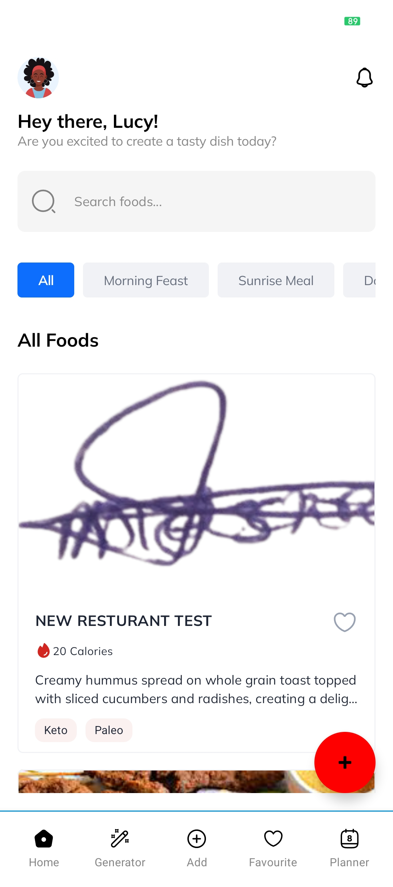
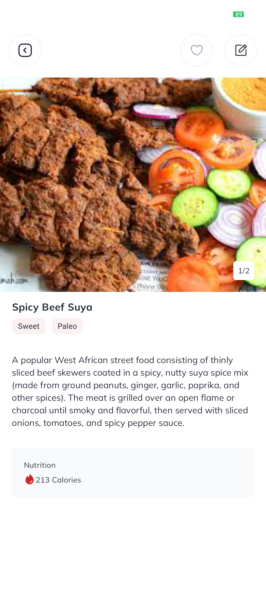
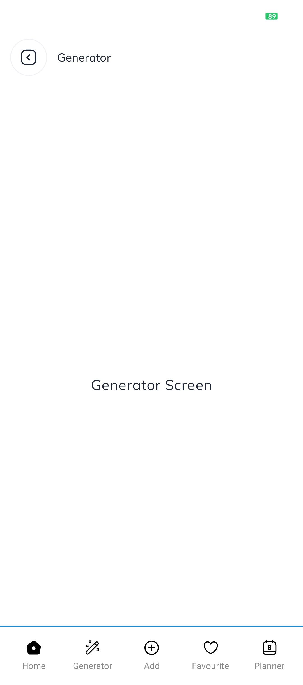
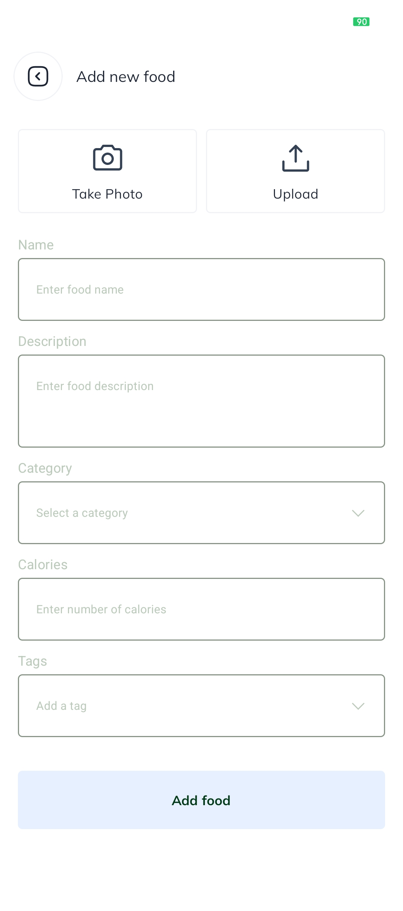
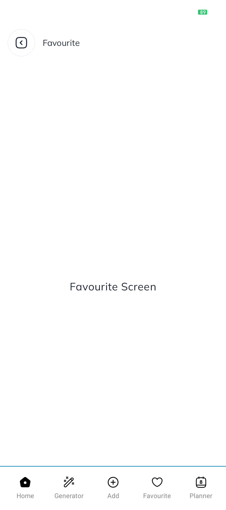
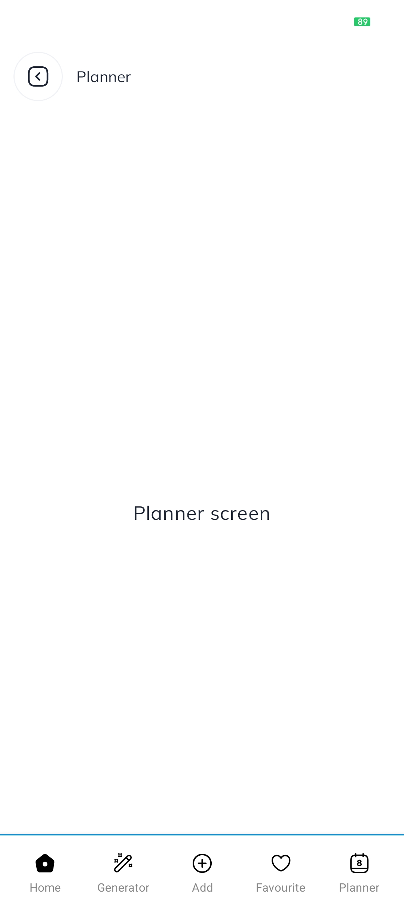

# TastyDishApp

An android app that display list of meals and view the meal details.

## Languages, libraries and tools used

* Kotlin
* Jetpack compose
* Compose navigation
* Coil - image loading
* Hilt - dependency injection
* Retrofit
* OkHttp
* Moshi
* KotlinX parcelize
* Room - for offline caching
* Flow coroutines

## How to run the project

* Download the latest android studio
* Clone the project from github using this command
  `git clone https://github.com/solobaba/TastyDishApp.git`
* Open the project in android studio
* Run the project on an emulator or a physical device

## Architecture

* This project makes use of MVVM architecture.
* The **data layer** is responsible communicating with the rest API.
* The **domain layer** is responsible for the business logic.
* The **presentation layer** is responsible for the UI.
* The **navigation layer** is responsible for the navigation.
* The **viewmodel layer** is responsible for the viewmodel.
* The **database layer** is responsible for the database.
* The **di layer** is responsible for the dependency injection.
* The **util layer** is responsible for the utility functions.

* Endpoints:
    * `api/foods`: A GET request that returns a list of food
    * `api/foods/id`: A GET request that returns the selected food details
* The **ViewModel** handles the UI logic
* The **Composables** render the UI

## Screenshots

  
  
  
  
  
  

